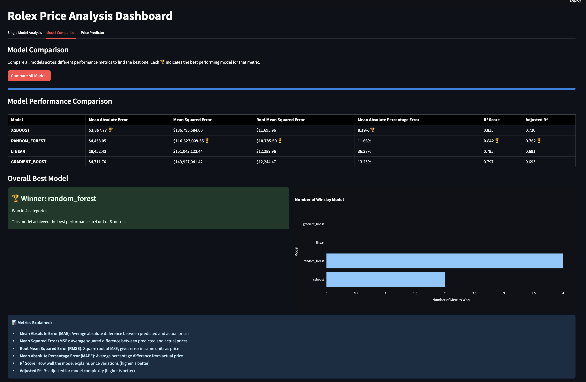
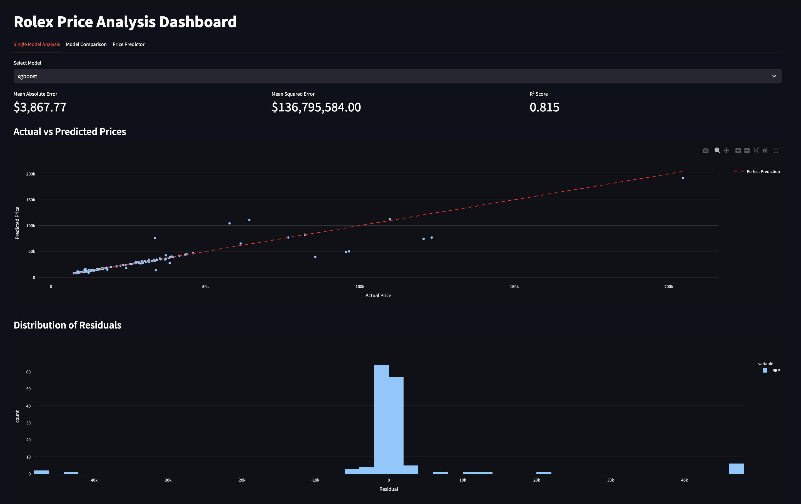
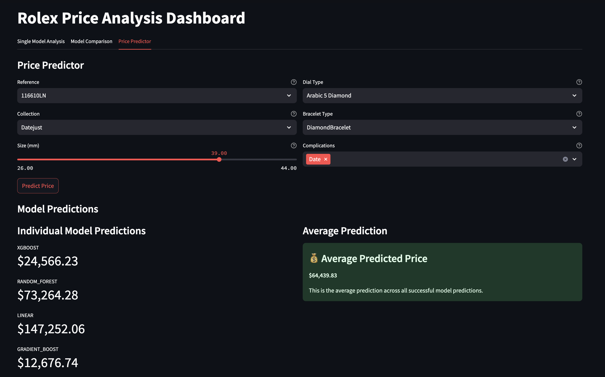

# RolexML - Advanced Machine Learning for Luxury Watch Price Prediction

A comprehensive machine learning system that leverages advanced algorithms and feature engineering to predict Rolex watch prices with high accuracy. This project implements a complete ML pipeline from data preprocessing to model deployment.

## Project Overview

RolexML demonstrates a sophisticated approach to price prediction in the luxury watch market through:

- 🔍 Advanced Feature Engineering
  - Custom engineered features for watch specifications
  - Complex interaction terms modeling
  - Automated feature selection pipeline
  - Domain-specific feature transformations

- 🤖 Machine Learning Pipeline
  - Robust data preprocessing and cleaning
  - Multi-model training architecture
  - Hyperparameter optimization
  - Model stacking and ensemble methods
  - Cross-validation strategy

- 📊 Model Ecosystem:
  - XGBoost with custom parameters
  - Random Forest with feature importance analysis
  - Linear Regression with regularization
  - Gradient Boosting with early stopping

## Visualizations

The following screenshots provide insights into the model performance and predictions:

### Model Comparison


### Single Model Analysis


### Price Predictor


## Technical Implementation

### Data Pipeline
- Raw data ingestion and validation
- Automated data cleaning and preprocessing
- Feature extraction and engineering
- Data normalization and scaling
- Train-test splitting with stratification

### Model Architecture
- Multi-model training system
- Hyperparameter optimization
- Model persistence and versioning
- Inference pipeline

### Evaluation Metrics
- Mean Absolute Error (MAE)
- Mean Squared Error (MSE)
- Root Mean Squared Error (RMSE)
- Mean Absolute Percentage Error (MAPE)
- R² Score and Adjusted R²

## Requirements

- Python 3.x
- Required packages in `requirements.txt`

## Installation

1. Clone the repository:
```bash
git clone https://github.com/yourusername/RolexML.git
cd RolexML
```

2. Install dependencies:
```bash
pip install -r requirements.txt
```

## Project Structure

- `model_trainer.py`: Core ML pipeline implementation
- `dashboard.py`: Interactive visualization interface
- `Retail_Prices.csv`: Training dataset

## Data Features

The model processes various watch characteristics including:
- Reference numbers
- Collections
- Case specifications
- Dial variations
- Bracelet types
- Complications
- Market-specific features

## Model Training Process

1. Data preprocessing and cleaning
2. Feature engineering and selection
3. Model training with cross-validation
4. Hyperparameter optimization
5. Model evaluation and selection
6. Deployment preparation

## Usage

```bash
# Train the models
python model_trainer.py

# Launch the visualization interface
streamlit run dashboard.py
```

## Contributing

Contributions are welcome! Please feel free to submit issues and pull requests.

## License

MIT License

## Author

Răzvan-Cosmin Cristia

## Acknowledgments

- scikit-learn and XGBoost for ML implementations
- Streamlit for visualization capabilities
- Plotly for interactive analytics